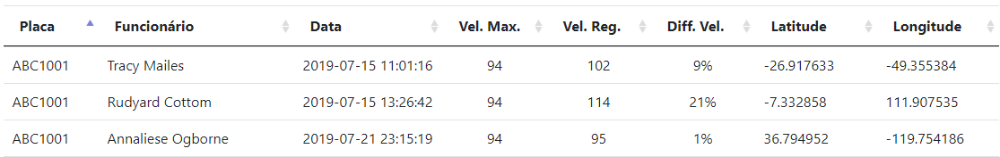

# Dev Web

Projeto para avaliação dos candidatos à vaga de desenvolvedor web.

## Requisitos

Para executar o projeto localmente você deve possuir:

- PHP com o módulo _pdo_mysql_ ativo


## Objetivo do candidato

Desenvolver, com base na estrutura dos dois relatórios existentes, um terceiro relatório chamado __Veículos acima da velocidade__.

Este relatório deve:

* buscar na tabela _rastreamento_ os registros em que o veículo estiver acima de sua velocidade máxima cadastrada.
* ter filtros de dados por placa do veículo, nome do funcionário e intervalo de data de ocorrência. 

O relatório deve possuir as seguintes colunas:

- Placa do veículo
- Nome do Funcionário
- Data da Ocorrência
- Velocidade maxima do veículo
- Velocidade registrada na ocorrência
- Diferença entre a velocidade permitida e registrada (%)
- Latitude
- Longitude

Será necessário enviar a estrutura do banco de dados criada pelo candidato.

Personalizações no layout do sistema serão avaliadas (imagem, icones, cores, efeito zebra, disposição dos objetos...)

Todas funcionalidades do sistema deverão estar funcionais (filtros, ordenações e afins)

### Exemplo do relatório final



## Envio do teste finalizado

Você deve clonar este projeto e republicá-lo em sua própria conta do GitHub. Não faça _fork_! Isso tornaria mais fácil a cópia do seu código por outros candidatos.

Após a publicação em sua conta do GitHub, responda o email que você recebeu e adicione no corpo o endereço do seu projeto.


## Banco de dados:

```sql

CREATE TABLE TrafficIncidents (
    VehiclePlate VARCHAR(10),
    EmployeeName VARCHAR(255),
    IncidentDate DATE,
    MaxSpeed INT,
    RecordedSpeed INT,
    SpeedDifferencePercentage DECIMAL(5, 2),
    Latitude DECIMAL(9, 6),
    Longitude DECIMAL(9, 6)
);

```

```sql

INSERT INTO TrafficIncidents (VehiclePlate, EmployeeName, IncidentDate, MaxSpeed, RecordedSpeed, SpeedDifferencePercentage, Latitude, Longitude)
VALUES
    ('ABC123', 'João', '2023-09-13', 100, 90, 10.00, 40.123456, -74.987654),
    ('XYZ789', 'Maria', '2023-09-14', 80, 82, 6.25, 39.876543, -75.123456),
    ('DEF456', 'Pedro', '2023-09-15', 120, 150, 8.33, 41.234567, -73.876543),
    ('GHI789', 'Ana', '2023-09-16', 90, 85, 5.56, 42.345678, -72.765432),
    ('JKL012', 'Carlos', '2023-09-17', 110, 111, 4.55, 38.987654, -76.234567),
    ('MNO345', 'Isabela', '2023-09-18', 70, 65, 7.14, 37.876543, -77.345678),
    ('PQR678', 'Eduardo', '2023-09-19', 95, 90, 5.26, 41.765432, -74.234567),
    ('STU901', 'Larissa', '2023-09-20', 75, 70, 6.67, 40.234567, -73.765432),
    ('VWX234', 'Fernanda', '2023-09-21', 110, 100, 9.09, 39.123456, -75.987654);


```
